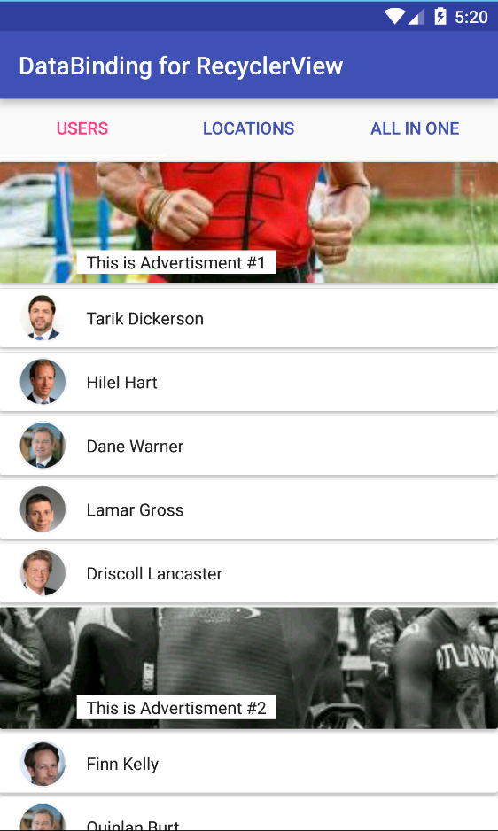
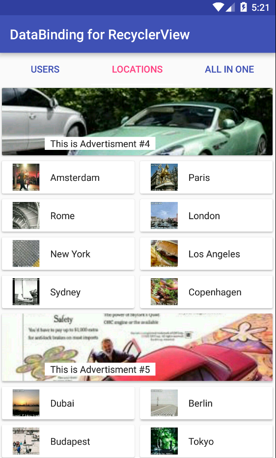
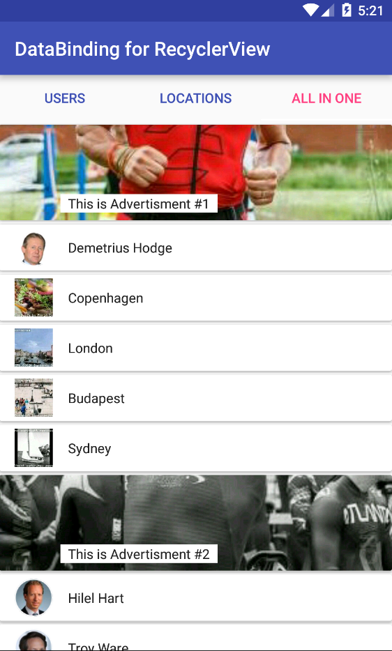

# DataBinding for RecyclerView

[](https://bintray.com/drstranges/android-extended/databinding-for-recyclerview)

## Overview

This library provides simple and flexible way to configuration RecyclerView using android data binding.

Add library as gradle dependency

```gradle
repositories { 
    jcenter()
}
dependencies {
    compile 'com.drextended.rvdatabinding:rvdatabinding:0.1.0'
}
```

## Features
- `.ListConfig` - Simple builder for configuration RecyclerView.
- `.BindableAdapter` - Simple Recycler View Adapter for using with data-binding.
- `.BindingHolder` - Simple View Holder for using with data-binding.
- `.DividerItemDecoration` - Simple divider decoration for RecyclerView.
- `.ColorDividerItemDecoration` - Simple colored divider decoration for RecyclerView.
- `.LoadMoreScrollListener` - Simple RecyclerView ScrollListener for implementing lazy loading list (endless list).
- `.TwoWayLoadingScrollListener` - Simple RecyclerView ScrollListener for implementing two-way lazy loading list (endless list).
- `.BaseBindingAdapterDelegate` - Base RecyclerView item delegate for using with data-binding.
- `.ModelItemDelegate` - Generic ActionDelegate. You can use this one if you do not want to implement custom one.

## Usage

###1. At first you definitely should have pojo-models for items

```java
    public class User implements BaseModel {
        public String name;
        public String avatar;
    }
    public class Location implements BaseModel {
        public String name;
        public String image;
    }
    public class Advertisement implements BaseModel {
        public String label;
        public String image;
    }
```

###2. Then you should create layouts for each item and for your list page

**fragment_page.xml**
```xml
    <layout ...>
        <data>
            <variable
                name="viewModel"
                type="com.drextended.rvdbsample.viewmodel.ListViewModel"/>
        </data>

        <android.support.v7.widget.RecyclerView
            android:layout_width="match_parent"
            android:layout_height="match_parent"
            app:listConfig="@{viewModel.getListConfig()}"/>

    </layout>
```

**item_user.xml**
```xml
    <layout xmlns:...>
        <data>
            <import type="com.drextended.rvdbsample.model.ActionType"/>

            <variable
                name="user"
                type="com.drextended.rvdbsample.model.User"/>

            <variable
                name="actionHandler"
                type="com.drextended.actionhandler.listener.ActionClickListener"/>
        </data>

        <android.support.v7.widget.CardView
            ...
            app:actionHandler="@{actionHandler}"
            app:actionType="@{ActionType.OPEN}"
            app:actionTypeLongClick="@{ActionType.MENU}"
            app:model="@{user}">

            <FrameLayout ...>

                <ImageView
                    ...
                    app:glideAnimation="@{R.anim.scale_in}"
                    app:glideCacheStrategy='@{"RESULT"}'
                    app:glidePath="@{user.avatar}"
                    app:glidePlaceholder="@{@android:drawable/ic_menu_gallery}"
                    app:glideTransform='@{"CIRCLE"}'
                    tools:src="@android:drawable/ic_menu_gallery"/>

                <TextView
                    ...
                    android:text="@{user.name}"/>

            </FrameLayout>
        </android.support.v7.widget.CardView>
    </layout>
```
 The same for **item_location.xml** and for **item_advertisement.xml**

###3. Then create ItemDelegates for items if you do not want to use generic

**UserDelegate.java**
```java
    public class UserDelegate extends ActionAdapterDelegate<BaseModel, ItemUserBinding> {

        public UserDelegate(final ActionClickListener actionHandler) {
            super(actionHandler);
        }

        @Override
        public boolean isForViewType(@NonNull final List<BaseModel> items, final int position) {
            return items.get(position) instanceof User;
        }

        @NonNull
        @Override
        public BindingHolder<ItemUserBinding> onCreateViewHolder(final ViewGroup parent) {
            return BindingHolder.newInstance(R.layout.item_user, LayoutInflater.from(parent.getContext()), parent, false);
        }

        @Override
        public void onBindViewHolder(@NonNull final List<BaseModel> items, final int position, @NonNull final BindingHolder<ItemUserBinding> holder) {
            final User user = (User) items.get(position);
            holder.getBinding().setUser(user);
            holder.getBinding().setActionHandler(getActionHandler());
        }

        @Override
        public long getItemId(final List<BaseModel> items, final int position) {
            return items.get(position).getId();
        }
    }
```

###4. Assemble all this in your viewmodel

**AllInOneListViewModel.java**
```java
    // Used action-handler library for handling click/long click in items: https://github.com/drstranges/ActionHandler
    final ActionClickListener actionHandler = new ActionHandler.Builder()
            //.addAction(null, new SimpleAnimationAction()) // Applied for any actionType
            //.addAction(null, new TrackAction()) // Applied for any actionType
            .addAction(ActionType.OPEN, new OpenProfileAction())
            .addAction(ActionType.MENU, new CompositeAction<String>(
                    (context, model) -> getTitle(model),
                    new ActionItem(ActionType.MENU_ITEM_1, new OpenSecondActivity(), R.string.menu_item_1),
                    new ActionItem(ActionType.MENU_ITEM_2, new ShowToastAction(), R.string.menu_item_2)
                    ))
            .setActionInterceptor(this)
            .setActionFiredListener(this)
            .build();

    // Build generic bindable adapter. Just list all used item delegates
    mAdapter = new BindableAdapter<>(
            new UserDelegate(actionHandler), // you can create custom delegate
            //new ModelActionItemDelegate<BaseModel>(actionHandler, User.class, R.layout.item_user, BR.user), // or use generic
            new ModelActionItemDelegate<BaseModel>(actionHandler, Location.class, R.layout.item_location, BR.location),
            new ModelActionItemDelegate<BaseModel>(actionHandler, Advertisement.class, R.layout.item_advertisment, BR.advertisment)
    );

    // Config for RecyclerView
    mListConfig = new ListConfig.Builder(mAdapter)
            .setLayoutManagerProvider(new SimpleGridLayoutManagerProvider(mSpanCount, getSpanSizeLookup())) // if not set, LinearLayoutManager applied by default
            .addItemDecoration(new ColorDividerItemDecoration(color, spacing, SPACE_LEFT|SPACE_TOP, false))
            //.setDefaultDividerEnabled(true)
            .addOnScrollListener(new OnLoadMoreScrollListener(mCallback))
            .setItemAnimator(getCustomItemAnimator())
//            .setHasFixedSize(true)
            .setItemTouchHelper(getItemTouchHelper())
            .build(context);

    loadData();
```

## Used Library:
  - [AdapterDelegates](https://github.com/sockeqwe/AdapterDelegates)
  - [ActionHandler](https://github.com/drstranges/ActionHandler)


## Inspired by:

https://github.com/sockeqwe/AdapterDelegates

http://hannesdorfmann.com/android/adapter-delegates

## Sample

[Sample apk file](./!_apk/sample.apk)

  

License
=======

    Copyright 2016 Roman Donchenko

    Licensed under the Apache License, Version 2.0 (the "License");
    you may not use this file except in compliance with the License.
    You may obtain a copy of the License at

       http://www.apache.org/licenses/LICENSE-2.0

    Unless required by applicable law or agreed to in writing, software
    distributed under the License is distributed on an "AS IS" BASIS,
    WITHOUT WARRANTIES OR CONDITIONS OF ANY KIND, either express or implied.
    See the License for the specific language governing permissions and
    limitations under the License.
